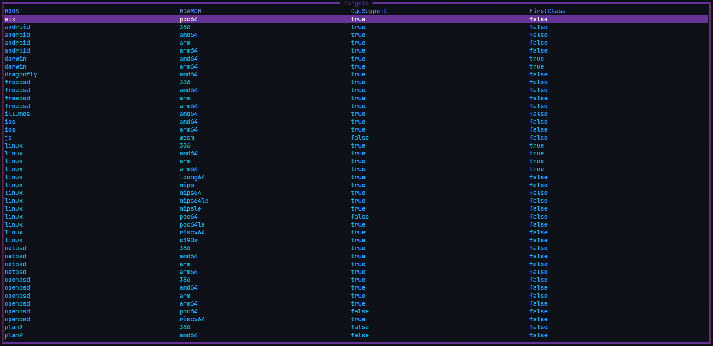
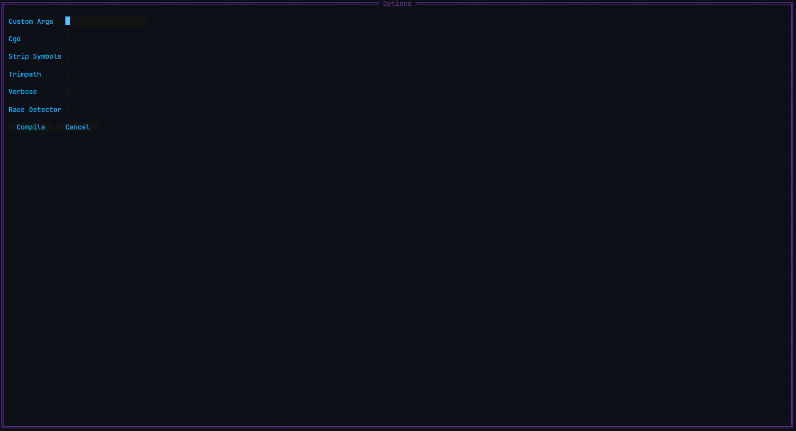
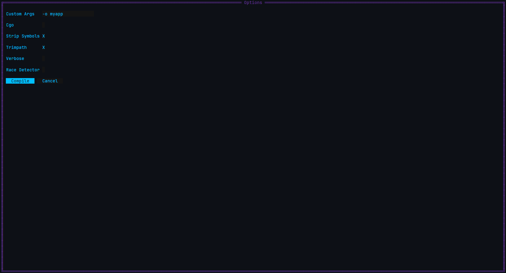

# gocomp
QoL tool for compiling Go code

## Compiling
```sh
wget https://github.com/everhaze/gocomp/archive/refs/heads/main.tar.gz
tar -xzf main.tar.gz
cd gocomp-main
go mod tidy
go build .
```

## Usage
There are 2 ways to use it.
### 1. CLI
```sh
#      mode  cgo  name
gocomp qs/cc 0/1 myapp

# qs = quick start
# cc = clean cache

# This is the bare minimum. It is the equivalent to 'CGO_ENABLED=0 go build -ldflags="-s -w" -trimpath'
gocomp qs

# Same example but with CGO_ENABLED=1
gocomp qs 1

# Same example but with a custom name
gocomp qs 0 myapp

# Note: If cgo isnt set to 1, it is always 0.
```

### 2. TUI
```sh
# For the TUI, you just run gocomp without passing any args.
gocomp
```
The TUI makes cross compiling as easy as it gets.\
It fetches the available targets directly from your go toolchain so it can stay up to date with your toolchain.\
This is what youll see after running gocomp.


Here you can configure the flags for go build.\
This is what youll see after selecting a target.


If you need flags that arent here, write them in "Custom Args" the same way youd write them in CLI.\
Heres an example.


## Note
If your target doesnt have cgo support, attempting to compile with cgo enabled will just cause it to compile without cgo.

If you want to use more -ldflags, make sure that "Strip Symbols" is disabled. Otherwise, your custom -ldflags will just get ignored as "Strip Symbols" (the latest flag) takes priority.

This tool also works reliably with older Go toolchains. Tested with Go 1.17.1 without any issues.
